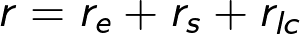
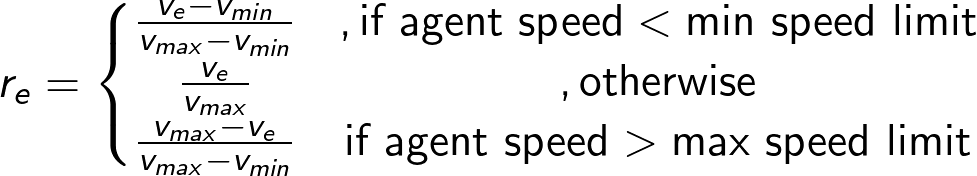
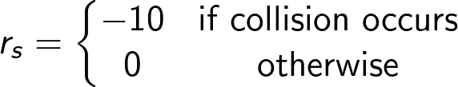
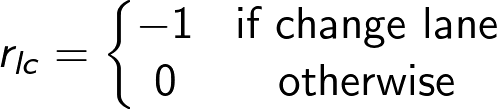
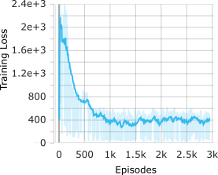
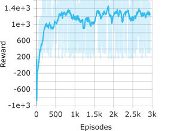

# RLDeepNavigation
Reach destination in short time. Autonomous vehicle (RL) agents reach its destination 

# A reinforcement learning framework for an autonomous vehicle to learn lateral and longitudinal control to navigate through deep traffic.

Taks Objectives:
- Make an autonomous agent to learn lane change and longitudinal control to navigate through deep traffic while maintaining better safety and higher traffic flow
- Provide a simple openAI like gym environment to work with reinforcement learning (RL) aglgorithm for lane change and highway driving scenario using Simulation of Urban Mobility (SUMO) simulator.


#### Approach
1. Create a custom gym environment using SUMO
2. Define highway driving and lane-changing problem as Markov decision process (MDP)

# Installation
---
# Install Latest version of [SUMO](https://sumo.dlr.de/docs/Downloads.php)
# Install custom SUMO Environment
``` Ruby
git@github.com:lokesh-c-das/AutonousVehicleDeepNavigation.git
cd SUMO-RL-ENVIRONMENT
pip install -e .
```
# Highway driving & lane changing problem formulation
We formulate the high driving and lane changing problem as a Markov decision process (MDP), where
# State Space:
The state space contains 19 different states of current environment conditions; from ego vehicle (aka RL agent) and its 3 leaders from inlane, target-left lane, target-right lane, and lanes average speed, and lanes density
# Action Space
5 discreate values that map
0 --> Keep current lane and speed
1 --> Change lane left
2 --> Change lane right
3 --> Accelerate (Constant amount)
4 --> Decelerate (Constant Amount)
# Reward
The reward function consists of a efficiency reward, lane change penalty reward, and a safety reward



## Efficiency Reward:


# Safety Reward

# Lane Change Penalty


# Results

### Training Reward and Loss


### Agent learn deep navigation with lane change
